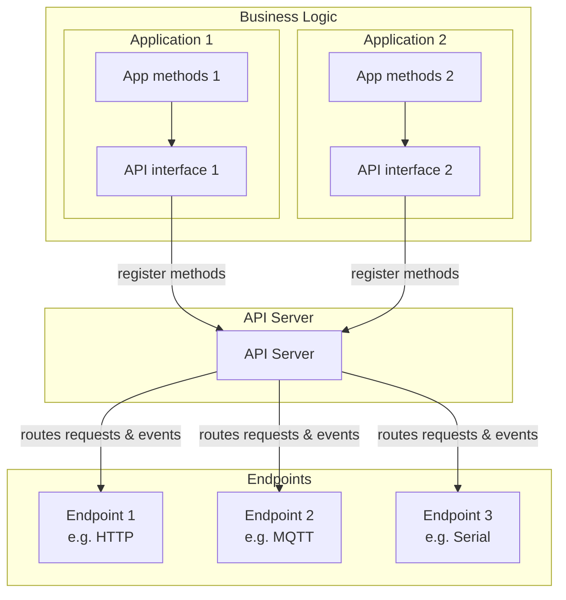
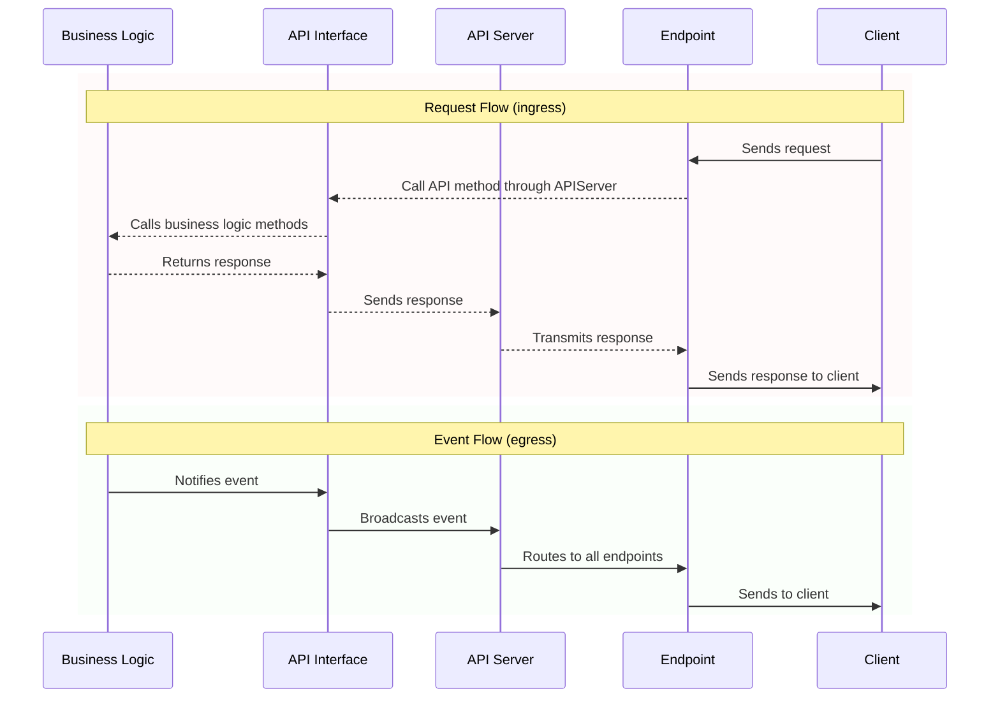

# APIServer Library Documentation

## Table of Contents
- [Architecture](#architecture)
- [Implementation](#implementation)
- [API Method Declaration](#api-method-declaration)
- [Documentation](#documentation)
- [Available Implementations](#available-implementations)
- [Creating a Custom API Server](#creating-a-custom-api-server)
- [Implementation Details](#implementation-details)

## Architecture

### Overview
The APIServer library addresses a common challenge in embedded systems development: creating maintainable and extensible APIs for IoT devices. Traditional approaches often lead to tightly coupled code where business logic, API endpoints, and communication protocols are intertwined, making it difficult to modify or extend functionality.

### Key Challenges & Features
- Separation of concerns between business logic and API implementation
- Intuitive route/method declaration
- Automatic API documentation generation
- Real-time event notifications support
- Seamless integration with various protocols (HTTP, WebSocket, MQTT, Serial, etc.)
- Support for nested objects in parameters and responses
- Facilitating the addition of new protocols with minimal changes

### Core Components
- **APIServer (Master Object)**
  - Central manager of API methods
  - Registers methods and their handlers
  - Manages automatic documentation
  - Coordinates different protocol endpoints
  - Broadcasts events

- **APIEndpoint (Class)**
  - Abstract base class for protocol servers
  - Wrapper for HTTP, WebSocket, Serial, MQTT...
  - Declares supported capabilities (getter, setter, event)

- **APIMethod (Structure)**
  - Type (GET/SET/EVT)
  - Stores parameters, response & callback
  - Builder pattern for declaration & auto-documentation

### Architecture diagram


### Data flow diagram for request & event



## Implementation

### Process
1. Create dedicated API interface class for each component (e.g. `WiFiManagerAPI.h`)
2. Declare API methods, events & handlers (setters/getters with business logic)
3. Declare & initialize API objects & endpoints in main
4. Poll regularly, or run within a task

> **Error handling note:**  
> Parameter type/value checking & error handling is responsibility of business logic.
> API Server only checks for presence of required parameters.

### Basic Implementation Example
Example of implementing an HTTP APIServer for a WiFi Manager:

```
wifimanager_app/
  ├── lib/
  │   ├── WiFiManager/
  │   │   ├── WiFiManager.cpp    // Business logic
  │   │   ├── WiFiManager.h      // Business logic
  │   │   └── WiFiManagerAPI.h   // Business logic API interface 
  │   └── APIServer/     
  │       ├── APIServer.h        // Core functionality
  │       ├── APIEndpoint.h      // Abstract endpoint implementation
  │       ├── WebAPIEndpoint.h   // HTTP/WS server implementation
  │       └── (...)              // Custom endpoints implementation
  └── src/
      └── main.cpp               // Main app file
```

> **Implementation Note:**  
> Initialization consists of creating stack objects (globals), passing the server to the application API and endpoint, and declaring the methods to use.

#### Main Application Setup: main.cpp
```cpp
#include "WiFiManager.h"
#include "WiFiManagerAPI.h"
#include "APIServer.h"
#include "WebAPIEndpoint.h"

WiFiManager wifiManager;  
APIServer apiServer;
WiFiManagerAPI wifiManagerAPI(wifiManager, apiServer);
WebAPIEndpoint webServer(apiServer, 80);

void setup() {
    apiServer.addEndpoint(&webServer);
    
    if (!wifiManager.begin()) {
       Serial.println("WiFiManager initialization error");
       while(1) {
           delay();
       }
     }
     
     apiServer.begin(); 
}

void loop() {
    wifiManager.poll();     // Polls WiFiManager utility
    wifiManagerAPI.poll();  // Polls WiFiManager API for events
    apiServer.poll();       // Polls API Server for client requests
}
```

#### API Method Registration: WiFiManagerAPI.h
```cpp
#include "WiFiManager.h"
#include "APIServer.h"

(...)  
    // GET wifi/scan
    _apiServer.registerMethod("wifi/scan",
        APIMethodBuilder(APIMethodType::GET, [this](const JsonObject* args, JsonObject& response) {
            _wifiManager.getAvailableNetworks(response);
            return true;
        })
        .desc("Scan available WiFi networks")
        .response("networks", {
            {"ssid", "string"},
            {"rssi", "int"},
            {"encryption", "int"}
        })
        .build()
    );
    
    // SET wifi/ap/config
    _apiServer.registerMethod("wifi/ap/config",
        APIMethodBuilder(APIMethodType::SET, [this](const JsonObject* args, JsonObject& response) {
            bool success = _wifiManager.setAPConfigFromJson(*args);
            response["success"] = success;
            return true;
        })
        .desc("Configure Access Point")
        .param("enabled", "bool")
        .param("ssid", "string")
        .param("password", "string")
        .param("channel", "int")
        .param("ip", "string", false)       // Optional parameter
        .param("gateway", "string", false)  // Optional parameter
        .param("subnet", "string", false)   // Optional parameter
        .response("success", "bool")
        .build()
    );
    
    // Other API Methods...
(...)
```

> **Note:** All initialized endpoints will automatically expose all API methods and autonomously execute client requests. 

> **Note:**The current design is not thread-safe, particularly when using asynchronous libraries like ESPAsyncWebserver, but this might be acceptable if all API-related tasks are grouped into a task running on the same core as the interfaces (UART, TCP/IP...).

## API Method Declaration

### Method Types

#### GET Methods
- Read-only operations
- No required request parameters
- Always return a response object

```cpp
apiServer.registerMethod("wifi/status",
    APIMethodBuilder(APIMethodType::GET, handler)
        .desc("Get WiFi status")
        .response("status", "object")
        .build()
);
```

#### SET Methods
- Modify system state
- Require request parameters
- Return success/failure response

```cpp
apiServer.registerMethod("wifi/sta/config",
    APIMethodBuilder(APIMethodType::SET, handler)
        .desc("Configure Station mode")
        .param("ssid", "string")
        .param("password", "string")
        .response("success", "bool")
        .build()
);
```

#### EVT Methods (Events)
- Server-initiated notifications
- No request parameters
- One-way communication (server to client)

```cpp
apiServer.registerMethod("wifi/events",
    APIMethodBuilder(APIMethodType::EVT)
        .desc("WiFi status updates")
        .response("status", "object")
        .build()
);
```

### Broadcasting Events
Unlike other methods, events must be called by the application API, for example to signal a status change.

```cpp
StaticJsonDocument<1024> newState;           // Create new JsonDocument
JsonObject status = newState["status"].to<JsonObject>();
_wifiManager.getStatusToJson(status);        // Fetch wifi status
_apiServer.broadcast("wifi/events", status); // Push event
```

> **Note:** Events are automatically transmitted to all endpoints that implement protocols handling events (Websocket, MQTT for example, defined in classes derived from APIEndpoint).

### Naming Patterns
- Use hierarchical paths: `component/resource`
- Use plural for collections: `clients/list`
- Include action in path: `wifi/scan`
- Clear & direct methods possible: `get_wifi_status`

### Nested Objects
The library supports nested objects at any depth level through recursive implementation.

#### Nested Object Example
```cpp
.response("status", {
    {"wifi", {
        {"enabled", "bool"},
        {"rssi", "int"},
        {"config", {
            {"ssid", "string"},
            {"password", "string"}
        }}
    }}
})
```

## Documentation
The library automatically generates comprehensive API documentation in JSON format. This documentation is available through the `/api` endpoint and provides a complete description of all available methods, their expected parameters (required/optional), and response structures.

### Example Generated Documentation
```json
{
  "methods": [{
    "path": "wifi/status",
    "type": "GET",
    "desc": "Get WiFi status",
    "protocols": ["http", "websocket"],
    "response": {
      "ap": {
        "enabled": "bool",
        "connected": "bool",
        "clients": "int",
        "ip": "string",
        "rssi": "int"
      },
      "sta": {
        "enabled": "bool",
        "connected": "bool",
        "ip": "string",
        "rssi": "int"
      }
    }
  },
  {
    "path": "wifi/sta/config",
    "type": "SET",
    "desc": "Configure Station mode",
    "protocols": ["http"],
    "params": {
      "enabled": "bool",
      "network": {
        "ssid": "string",
        "password": "string",
        "security": {
          "type": "string",
          "certificates": {
            "ca": "string*",
            "client": "string*"
          }
        }
      }
    },
    "response": {
      "success": "bool",
      "error": "string*"
    }
  }]
}
```

## Available Implementations

The following protocol implementations are available out of the box:

### HTTP/WebSocket API
A complete HTTP REST API with WebSocket support for real-time events. Based on ESPAsyncWebServer.
[Documentation](docs/README_web.md)

### MQTT API
MQTT implementation with topic-based routing and JSON payloads. Based on PubSubClient.
[Documentation](docs/README_mqtt.md)

### Serial API
Human-readable serial protocol with line-oriented commands. Works with any Stream object (UART, USB CDC).
[Documentation](docs/README_serial.md)

## Creating a Custom API Server
To create a new protocol server, inherit from the `APIEndpoint` class and implement the virtual methods.

### Custom Endpoint Example
```cpp
class MyCustomEndpoint : public APIEndpoint {
public:
    MyCustomEndpoint(APIServer& apiServer, uint16_t port) 
        : APIEndpoint(apiServer) {
        // Declare supported capabilities
        addProtocol("custom", GET | SET | EVT);
    }

    void begin() override {
        // Initialize your endpoint
        _server.begin();
    }

    void poll() override {
        // Process incoming requests from your protocol
        _processIncomingRequests();
        
        // Process outgoing events queue
        _processEventQueue();
    }

    void pushEvent(const String& event, const JsonObject& data) override {
        // Queue or send events to connected clients
        if (_eventQueue.size() >= MAX_QUEUE_SIZE) {
            _eventQueue.pop();
        }
        _eventQueue.push(_formatEvent(event, data));
    }

private:
    MyCustomServer _server;
    std::queue<String> _eventQueue;
    
    void _processIncomingRequests() {
        // Read incoming data from your protocol
        if (_server.hasData()) {
            auto request = _server.read();
            
            // Parse the request to extract method, path and parameters
            auto parsedRequest = _parseRequest(request);
            
            // Create response document
            StaticJsonDocument<512> doc;
            JsonObject response = doc.to<JsonObject>();
            
            // Execute the API method
            if (_apiServer.executeMethod(
                parsedRequest.path,
                parsedRequest.hasParams ? &parsedRequest.params : nullptr,
                response
            )) {
                _server.send(_formatResponse(parsedRequest.path, response));
            } else {
                _server.send(_formatError("Invalid Request"));
            }
        }
    }
    
    void _processEventQueue() {
        while (!_eventQueue.empty()) {
            _server.broadcast(_eventQueue.front());
            _eventQueue.pop();
        }
    }
};
```
### Key Points

Each endpoint is responsible for:
- Protocol initialization (begin)
- Polling for incoming requests
- Parsing requests according to protocol format
- Formatting responses
- Managing event notifications queue

The endpoint uses the APIServer to:
- Execute API methods (_apiServer.executeMethod)
- Get API documentation (_apiServer.getAPIDoc)
- Register itself (_apiServer.addEndpoint)

No constraint on request/response format:
- Each protocol defines its own format
- Parsing/formatting is handled by the endpoint
- Only requirement is to convert to/from JsonObject for API method execution

> **Best Practices**
> - Keep parsing logic separate from request handling
> - Use a queue for event notifications to avoid blocking
> - Implement error handling appropriate for your protocol
> - Consider implementing a debug mode for logging
> For more details on server implementation, see existing implementations (ESPAsyncWebserial, MQTT, Serial...).

## Implementation Details

### Memory Management
- Using `StaticJsonDocument` for storing methods
- Default size: 2048 bytes for documentation
- Fixed stack allocation, no dynamic memory allocation during runtime
- Vector sizes are determined at compile time

> **Memory Considerations:**  
> - Be mindful of stack size when using deeply nested objects
> - Monitor memory usage with maximum expected payload sizes
> - Consider static allocation limits on your target platform

### Parameter Validation
Parameter validation is intentionally simple:
- Verification of required parameters presence
- No type validation (handled by business logic)
- No recursive validation of nested objects (level 1 verification: object)
- Invalid configurations cause compilation errors

> **Design Philosophy:**  
> The library focuses on providing a robust foundation while allowing business logic to implement specific validation requirements. This separation of concerns ensures flexibility while maintaining code clarity.