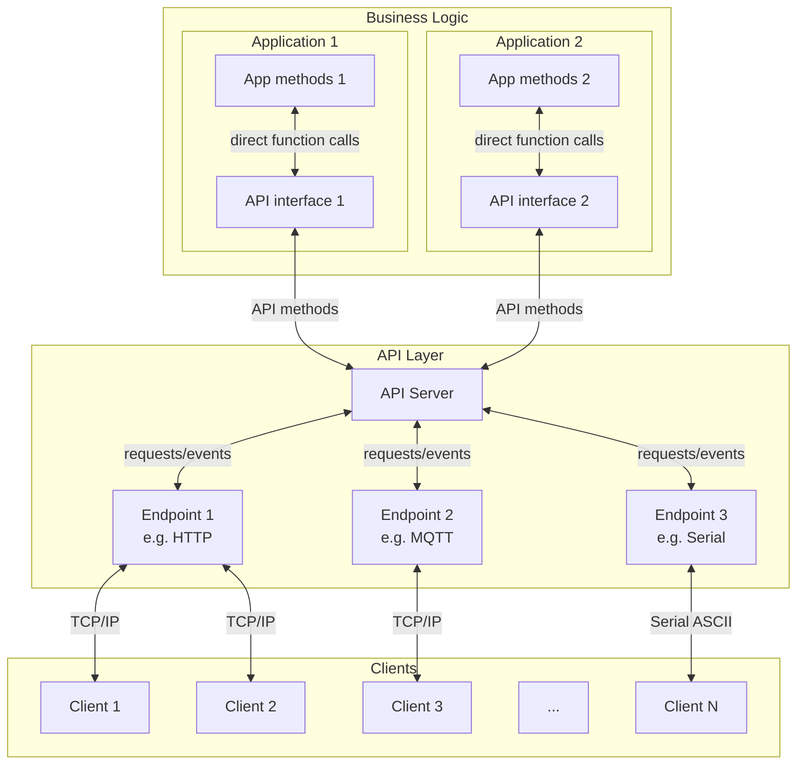
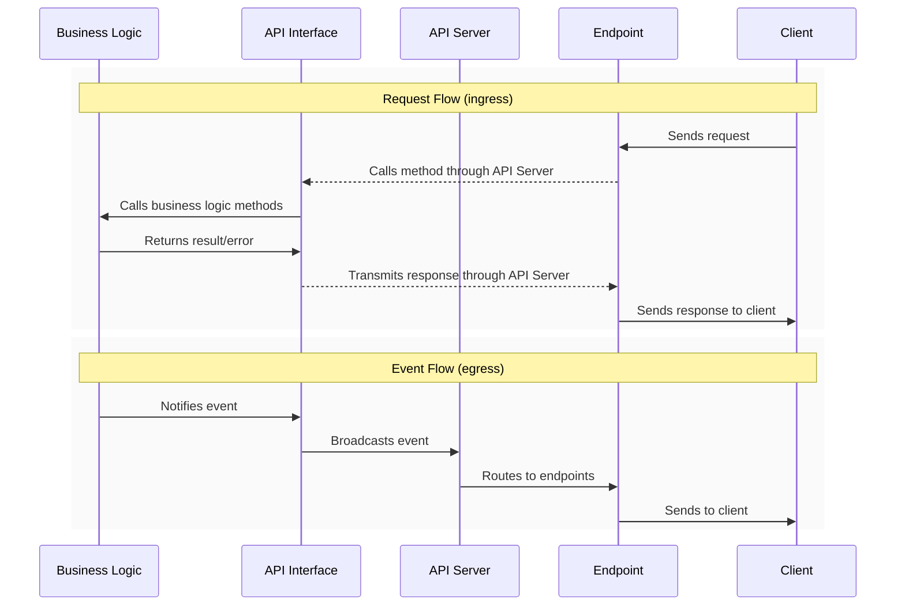

# APIServer Library Documentation

## Table of Contents
- [Architecture](#architecture)
- [Integration](#integration)
- [API Method Declaration](#api-method-declaration)
- [Documentation](#documentation)
- [Available Implementations](#available-implementations)
- [Creating a Custom API Server](#creating-a-custom-api-server)
- [Implementation Details](#implementation-details)

## Architecture

### Overview
The APIServer library addresses a common challenge in embedded systems development: creating maintainable and extensible APIs for IoT devices. Traditional approaches often lead to tightly coupled code where business logic, API endpoints, and communication protocols are intertwined, making it difficult to modify or extend functionality.

### Key Challenges & Features
- Separation of concerns between business logic and API implementation
- Intuitive route/method declaration
- Fully autonomous, asynchronous, non-blocking operations to serve requests
- Automatic API documentation generation
- Real-time event notifications support
- Seamless integration with various protocols (HTTP, WebSocket, MQTT, Serial, etc.)
- Support for nested objects in parameters and responses
- Facilitating the addition of new protocols with minimal changes

### Core Components
- **APIServer (Master Object)**
  - Central manager of API methods
  - Registers methods and their handlers
  - Manages automatic documentation
  - Coordinates different protocol endpoints
  - Broadcasts events

- **APIEndpoint (Class)**
  - Abstract base class for protocol servers
  - Wrapper for HTTP, WebSocket, Serial, MQTT...
  - Declares supported capabilities (getter, setter, event)

- **APIMethod (Structure)**
  - Type (GET/SET/EVT)
  - Stores parameters, response & callback
  - Builder pattern for declaration & auto-documentation

### Architecture diagram


### Data flow diagram for request & event



## Integration

### Process
1. Create dedicated application API interface class for each component (e.g. `WiFiManagerAPI.h`)
2. Declare API methods, events & handlers (setters/getters with business logic)
3. Declare & initialize API & endpoints instances in main
4. Poll APIServer regularly, or run within a task to let client requests be handled automatically in background

> **Note on error handling:**  
> Parameter type/value checking & error handling is responsibility of business logic.
> API Server only checks for presence of required parameters.

### Basic Integration Example
Example of implementing an HTTP APIServer for a WiFi Manager:

```
wifimanager_app/
  ├── lib/
  │   ├── WiFiManager/
  │   │   ├── WiFiManager.cpp    // Business logic
  │   │   ├── WiFiManager.h      // Business logic
  │   │   └── WiFiManagerAPI.h   // Business logic API interface 
  │   └── APIServer/     
  │       ├── APIServer.h        // Core functionality
  │       ├── APIEndpoint.h      // Abstract endpoint implementation
  │       ├── WebAPIEndpoint.h   // HTTP/WS server implementation
  │       └── (...)              // Custom endpoints implementation
  └── src/
      └── main.cpp               // Main app file
```

Initialization consists of creating stack objects (globals), passing the server to the application API and endpoint, and declaring the methods to use.

#### Main Application Setup: main.cpp
```cpp
#include "WiFiManager.h"
#include "WiFiManagerAPI.h"
#include "APIServer.h"
#include "WebAPIEndpoint.h"

WiFiManager wifiManager;  
APIServer apiServer;
WiFiManagerAPI wifiManagerAPI(wifiManager, apiServer);
WebAPIEndpoint webServer(apiServer, 80);

void setup() {
    apiServer.addEndpoint(&webServer);
    
    if (!wifiManager.begin()) {
       Serial.println("WiFiManager initialization error");
       while(1) {
           delay();
       }
     }
     
     apiServer.begin(); 
}

void loop() {
    wifiManager.poll();     // Polls WiFiManager utility
    wifiManagerAPI.poll();  // Polls WiFiManager API for events
    apiServer.poll();       // Polls API Server for client requests
}
```

#### API Method Registration: WiFiManagerAPI.h
```cpp
#include "WiFiManager.h"
#include "APIServer.h"

(...)  
    // GET wifi/scan
    _apiServer.registerMethod("wifi/scan",
        APIMethodBuilder(APIMethodType::GET, [this](const JsonObject* args, JsonObject& response) {
            _wifiManager.getAvailableNetworks(response);
            return true;
        })
        .desc("Scan available WiFi networks")
        .response("networks", {
            {"ssid", "string"},
            {"rssi", "int"},
            {"encryption", "int"}
        })
        .build()
    );
    
    // SET wifi/ap/config
    _apiServer.registerMethod("wifi/ap/config",
        APIMethodBuilder(APIMethodType::SET, [this](const JsonObject* args, JsonObject& response) {
            bool success = _wifiManager.setAPConfigFromJson(*args);
            response["success"] = success;
            return true;
        })
        .desc("Configure Access Point")
        .param("enabled", "bool")
        .param("ssid", "string")
        .param("password", "string")
        .param("channel", "int")
        .param("ip", "string", false)       // Optional parameter
        .param("gateway", "string", false)  // Optional parameter
        .param("subnet", "string", false)   // Optional parameter
        .response("success", "bool")
        .build()
    );
    
    // Other API Methods...
(...)
```

> **General notes:** 
> - All initialized endpoints will automatically expose all API methods and autonomously execute client requests. 
> - Managing requests timing is the user's responsibility: in case of very long processing times for certain methods, consider using an asynchronous approach to avoid blocking endpoints (e.g. sending an immediate response to the client to validate the request and a second response after process completion, for example through an event).

> **Notes on thread-safety:**  
> The current design is not thread-safe, particularly when using asynchronous libraries like ESPAsyncWebserver. However, in single-thread operation the behavior is deterministic and safe and can be quite reactive with proper endpoint implementation (e.g. splitting Serial messages in chunks to avoid blocking the main task with I/O operations). This will be a major focus for the next releases which will fully use FreeRTOS features. It will include:
> - Mutex protection for APIServer methods
> - Event queue system for broadcasts
> - Dedicated tasks for request handling
> - Proper timeout management, etc.
>
> The idea is to isolate the API Server in a dedicated task to handle requests and events, while allowing the business logic to run in the main thread. This will allow to fully & safely benefit from the performance of dual core MCUs like ESP32-S3: one core can be dedicated to networking & API tasks (this is already the case for WiFi and TCP/IP stack), while the other one runs the business logic.


## API Method Declaration

### Method Types

#### GET Methods
- Read-only operations
- No required request parameters
- Always return a response object

```cpp
apiServer.registerMethod("wifi/status",
    APIMethodBuilder(APIMethodType::GET, handler)
        .desc("Get WiFi status")
        .response("status", "object")
        .build()
);
```

#### SET Methods
- Modify system state
- Require request parameters
- Returns at least a success/failure response

```cpp
apiServer.registerMethod("wifi/sta/config",
    APIMethodBuilder(APIMethodType::SET, handler)
        .desc("Configure Station mode")
        .param("ssid", "string")
        .param("password", "string")
        .response("success", "bool")
        .build()
);
```

#### EVT Methods (Events)
- Server-initiated notifications
- No request parameters
- One-way communication (server to client)

```cpp
apiServer.registerMethod("wifi/events",
    APIMethodBuilder(APIMethodType::EVT)
        .desc("WiFi status updates")
        .response("status", "object")
        .build()
);
```

##### Broadcasting Events
Unlike other methods, events are not handled automatically upon client request, they must be called by the application API (for example to signal a status change to all connected clients).

There are several approaches to handle state changes:

1. **Polling Approach** (simplest but dumbest)
```cpp
// Inside application API
void WiFiManagerAPI::poll() {
    if (millis() - _lastCheck > CHECK_INTERVAL) {
        StaticJsonDocument<1024> newState;
        JsonObject status = newState.to<JsonObject>();
        _wifiManager.getStatusToJson(status);
        
        if (newState != _previousState) {
            _apiServer.broadcast("wifi/events", status);
            _previousState = newState;
        }
    }
}
```

2. **Observer Pattern** (recommended approach)
```cpp
// Inside business logic class
class WiFiManager {
private:
    std::function<void()> _onStateChange;

public:
    void onStateChange(std::function<void()> callback) {
        _onStateChange = callback;
    }
    
protected:
    void notifyStateChange() {
        if (_onStateChange) {
            _onStateChange();
        }
    }
};
```

```cpp
// Inside business logic API interface
class WiFiManagerAPI {
public:
    WiFiManagerAPI(WiFiManager& wifiManager, APIServer& apiServer) 
        : _wifiManager(wifiManager)
        , _apiServer(apiServer)
    {
        // Subscribe to WiFi state changes
        _wifiManager.onStateChange([this]() {
            StaticJsonDocument<1024> stateDoc;
            JsonObject state = stateDoc.to<JsonObject>();
            _wifiManager.getStatusToJson(state);
            _apiServer.broadcast("wifi/events", state);
        });
    }
};
```

The Observer pattern (via callback) offers several advantages:
- No polling needed (better performance), just call the `notifyStateChange()` method when you need to broadcast a state change
- State changes are captured immediately
- Separation of concerns conserved, at the expense of a single callback registration:
  - Business logic (WiFiManager) notifies state changes
  - API layer (WiFiManagerAPI) handles the event broadcasting
- Easy to add multiple callbacks if needed

> **Implementation Note:**  
> The callback approach presented here is simpler than a full Observer pattern implementation while providing the same benefits. It's particularly useful when:
> - State changes are infrequent or unpredictable
> - Real-time updates are important
> - You want to avoid polling overhead
> If you need more flexibility, consider implementing a full Observer pattern.

### Nested Objects
The library supports nested objects at any depth level through recursive implementation.

#### Nested Object Example
```cpp
.response("status", {
    {"wifi", {
        {"enabled", "bool"},
        {"rssi", "int"},
        {"config", {
            {"ssid", "string"},
            {"password", "string"}
        }}
    }}
})
```

### Protocol exclusions
Methods can be configured to exclude specific protocols. This is useful when certain operations should not be available through specific communication channels (for security or technical reasons).
```cpp
// Exclude a single protocol
apiServer.registerMethod("wifi/password",
    APIMethodBuilder(APIMethodType::GET, handler)
        .desc("Get WiFi password")
        .response("password", "string")
        .excl("http")  // Exclude from HTTP
        .build()
);

// Exclude multiple protocols
apiServer.registerMethod("system/reset",
    APIMethodBuilder(APIMethodType::SET, handler)
        .desc("Reset system")
        .param("delay", "int")
        .response("success", "bool")
        .excl({"http", "mqtt"})  // Exclude from both HTTP and MQTT
        .build()
);
```
The exclusions are:
- Automatically handled by the API Server
- Reflected in the API documentation
- Applied at the protocol level (excluded methods are not visible to clients)

### Naming Patterns tips
- Use hierarchical paths: `component/resource`
- Use plural for collections: `clients/list`
- Include action in path: `wifi/scan`
- Clear & direct methods possible: `get_wifi_status`

## Documentation
The library automatically generates comprehensive API documentation in JSON format. This documentation is available through the `/api` endpoint and provides a complete description of all available methods, their expected parameters (required/optional), and response structures.

### Example Generated Documentation
```json
{
  "methods": [{
    "path": "wifi/status",
    "type": "GET",
    "desc": "Get WiFi status",
    "protocols": ["http", "websocket"],
    "response": {
      "ap": {
        "enabled": "bool",
        "connected": "bool",
        "clients": "int",
        "ip": "string",
        "rssi": "int"
      },
      "sta": {
        "enabled": "bool",
        "connected": "bool",
        "ip": "string",
        "rssi": "int"
      }
    }
  },
  {
    "path": "wifi/sta/config",
    "type": "SET",
    "desc": "Configure Station mode",
    "protocols": ["http"],
    "params": {
      "enabled": "bool",
      "network": {
        "ssid": "string",
        "password": "string",
        "security": {
          "type": "string",
          "certificates": {
            "ca": "string*",
            "client": "string*"
          }
        }
      }
    },
    "response": {
      "success": "bool",
      "error": "string*"
    }
  }]
}
```

## Available Implementations

The following protocol implementations are available out of the box:

### HTTP/WebSocket API
A complete HTTP REST API with WebSocket support for real-time events. Based on ESPAsyncWebServer.
[Documentation](docs/README_web.md)

### MQTT API
MQTT implementation with topic-based routing and JSON payloads. Based on PubSubClient.
[Documentation](docs/README_mqtt.md)

### Serial API
Human-readable serial protocol with line-oriented commands. Works with any Stream object (UART, USB CDC).
[Documentation](docs/README_serial.md)

## Creating a Custom API Server
To create a new protocol server, inherit from the `APIEndpoint` class and implement the virtual methods.

### Custom Endpoint Example
```cpp
class MyCustomEndpoint : public APIEndpoint {
public:
    MyCustomEndpoint(APIServer& apiServer, uint16_t port) 
        : APIEndpoint(apiServer) {
        // Declare supported capabilities
        addProtocol("custom", GET | SET | EVT);
    }

    void begin() override {
        // Initialize your endpoint
        _server.begin();
    }

    void poll() override {
        // Process incoming requests from your protocol
        _processIncomingRequests();
        
        // Process outgoing events queue
        _processEventQueue();

        // Other actions (might include flush disconnections, etc.)
    }

    void pushEvent(const String& event, const JsonObject& data) override {
        // Queue or send events to connected clients
        if (_eventQueue.size() >= MAX_QUEUE_SIZE) {
            _eventQueue.pop();
        }
        _eventQueue.push(_formatEvent(event, data));
    }

private:
    MyCustomServer _server;
    std::queue<String> _eventQueue;
    
    void _processIncomingRequests() {
        // Read incoming data from your protocol
        if (_server.hasData()) {
            auto request = _server.read();
            
            // Parse the request to extract method, path and parameters
            auto parsedRequest = _parseRequest(request);
            
            // Create response document
            StaticJsonDocument<512> doc;
            JsonObject response = doc.to<JsonObject>();
            
            // Execute the API method
            if (_apiServer.executeMethod(
                parsedRequest.path,
                parsedRequest.hasParams ? &parsedRequest.params : nullptr,
                response
            )) {
                _server.send(_formatResponse(parsedRequest.path, response));
            } else {
                _server.send(_formatError("Invalid Request"));
            }
        }
    }
    
    void _processEventQueue() {
        while (!_eventQueue.empty()) {
            _server.broadcast(_eventQueue.front());
            _eventQueue.pop();
        }
    }
};
```
### Key Points

Each endpoint is responsible for:
- Protocol initialization (begin)
- Polling for incoming requests
- Parsing requests according to protocol format
- Formatting responses
- Managing event notifications queue

The endpoint uses the APIServer to:
- Execute API methods (_apiServer.executeMethod)
- Get API documentation (_apiServer.getAPIDoc)
- Register itself (_apiServer.addEndpoint)

No constraint on request/response format:
- Each protocol defines its own format
- Parsing/formatting is handled by the endpoint
- Only requirement is to convert to/from JsonObject for API method execution

> **Best Practices**
> - Keep parsing logic separate from request handling
> - Use a queue for event notifications to avoid blocking
> - Implement error handling appropriate for your protocol
> - Consider implementing a debug mode for logging
> For more details on server implementation, see existing implementations (ESPAsyncWebserial, MQTT, Serial...).

## Implementation Details

### Memory Management

#### Core Library
- API methods and their metadata (parameters, descriptions) are stored in fixed structures
- All internal containers (vectors, maps) use fixed sizes determined at compile time
- No dynamic memory allocation in the core library during runtime
- Stack allocation is used for method registration and documentation generation

#### Request & Event Handling
- The API Server only manipulates references to JsonObject/JsonArray
- Memory allocation for requests/responses is handled by each endpoint implementation
- Endpoints are free to choose their memory management strategy:
  ```cpp
  // Example: Static allocation in HTTP endpoint
  StaticJsonDocument<1024> _requestDoc;
  JsonObject request = _requestDoc.to<JsonObject>();
  parseHttpRequest(request);  // Fill request object
  
  StaticJsonDocument<1024> _responseDoc;
  JsonObject response = _responseDoc.to<JsonObject>();
  _apiServer.executeMethod("some/path", &request, response);
  ```

> **Memory Considerations:**  
> - Monitor stack usage when implementing deep method chains or complex parameter structures
> - Consider platform limitations when defining fixed container sizes
> - Choose appropriate document sizes in endpoint implementations based on your API's needs
> - For endpoints handling multiple simultaneous requests, consider using a pool of pre-allocated documents

### Parameter Validation
Parameter validation is intentionally simple:
- Verification of required parameters presence
- No type validation (handled by business logic)
- No recursive validation of nested objects (level 1 verification: object)
- Invalid configurations cause compilation errors

> **Design Philosophy:**  
> The library focuses on providing a robust foundation while allowing business logic to implement specific validation requirements. This separation of concerns ensures flexibility while maintaining code clarity.