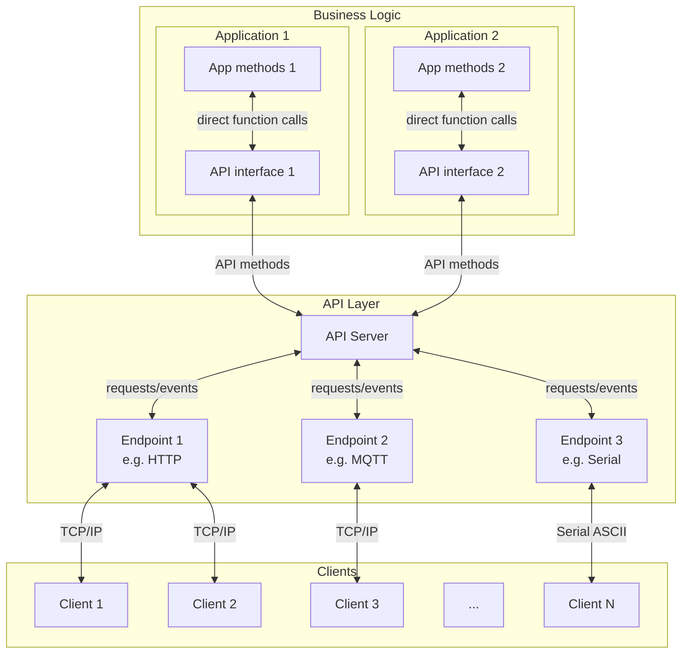
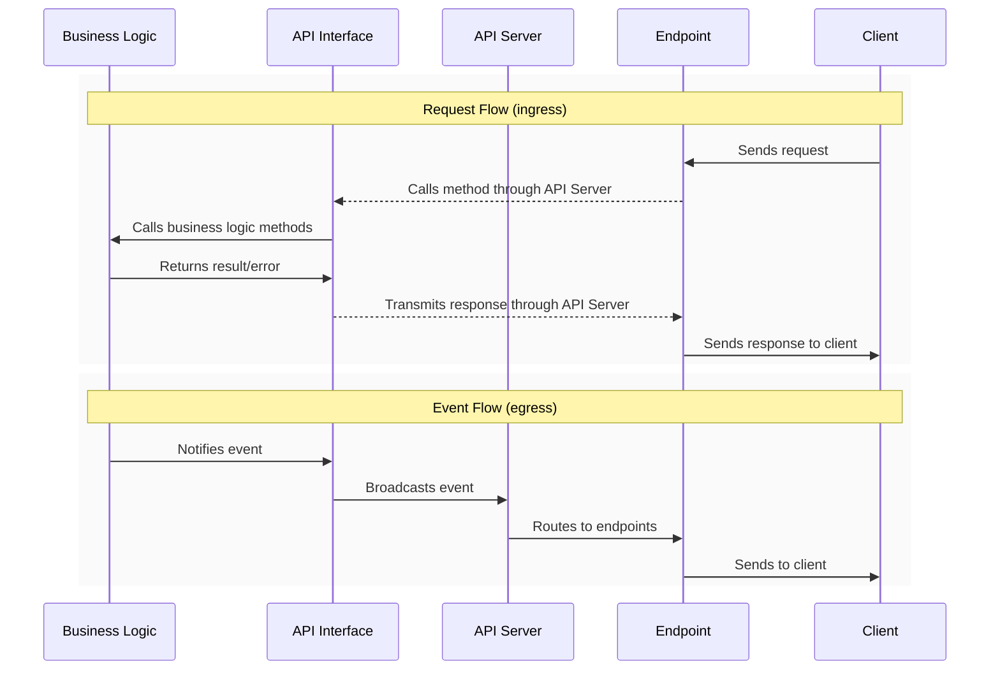

# APIServer Library Documentation

## Table of Contents
- [Architecture](#architecture)
- [Integration](#integration)
- [API Method Declaration](#api-method-declaration)
- [Documentation](#documentation)
- [Available Implementations](#available-implementations)
- [Creating a Custom API Server](#creating-a-custom-api-server)
- [Implementation Details](#implementation-details)

## Architecture

### Overview
The APIServer library provides a flexible framework for implementing APIs on embedded systems, with:
- Separation of business logic and API implementation
- Protocol-agnostic method declaration
- Automatic documentation generation
- Real-time event system
- Multi-protocol support (HTTP, WebSocket, MQTT, Serial)

### Core Components

#### APIServer
- Manages API methods and endpoints
- Routes requests to handlers
- Broadcasts events
- Generates documentation

#### APIEndpoint
- Abstract base class for protocol implementations
- Declares protocol capabilities (GET/SET/EVT)
- Handles request parsing and response formatting

#### APIMethod
- Type (GET/SET/EVT)
- Parameters and response structure
- Handler function
- Protocol exclusions

### Architecture diagram


### Data flow diagram for request & event



## Integration

### Process
1. Create dedicated application API interface class for each component (e.g. `WiFiManagerAPI.h`)
2. Declare API methods, events & handlers (setters/getters with business logic)
3. Declare & initialize API & endpoints instances in main
4. Poll APIServer regularly, or run within a task to let client requests be handled automatically in background

> **Note on error handling:**  
> Parameter type/value checking & error handling is responsibility of business logic.
> API Server only checks for presence of required parameters.

### Basic Integration Example
Example of implementing an HTTP APIServer for a WiFi Manager:

```
wifimanager_app/
  ├── lib/
  │   ├── WiFiManager/
  │   │   ├── WiFiManager.cpp    // Business logic
  │   │   ├── WiFiManager.h      // Business logic
  │   │   └── WiFiManagerAPI.h   // Business logic API interface 
  │   └── APIServer/     
  │       ├── APIServer.h        // Core functionality
  │       ├── APIEndpoint.h      // Abstract endpoint implementation
  │       ├── WebAPIEndpoint.h   // HTTP/WS server implementation
  │       └── (...)              // Custom endpoints implementation
  └── src/
      └── main.cpp               // Main app file
```

Initialization consists of creating stack objects (globals), passing the server to the application API and endpoint, and declaring the methods to use.

#### Main Application Setup: main.cpp
```cpp
#include "WiFiManager.h"
#include "WiFiManagerAPI.h"
#include "APIServer.h"
#include "WebAPIEndpoint.h"

WiFiManager wifiManager;  
APIServer apiServer;
WiFiManagerAPI wifiManagerAPI(wifiManager, apiServer);
WebAPIEndpoint webServer(apiServer, 80);

void setup() {
    apiServer.addEndpoint(&webServer);
    
    if (!wifiManager.begin()) {
       Serial.println("WiFiManager initialization error");
       while(1) {
           delay();
       }
     }
     
     apiServer.begin(); 
}

void loop() {
    wifiManager.poll();     // Polls WiFiManager utility
    wifiManagerAPI.poll();  // Polls WiFiManager API for events
    apiServer.poll();       // Polls API Server for client requests
}
```

#### API Method Registration: WiFiManagerAPI.h
```cpp
#include "WiFiManager.h"
#include "APIServer.h"

(...)  
    // GET wifi/scan
    _apiServer.registerMethod("wifi/scan",
        APIMethodBuilder(APIMethodType::GET, [this](const JsonObject* args, JsonObject& response) {
            _wifiManager.getAvailableNetworks(response);
            return true;
        })
        .desc("Scan available WiFi networks")
        .response("networks", {
            {"ssid", "string"},
            {"rssi", "int"},
            {"encryption", "int"}
        })
        .build()
    );
    
    // SET wifi/ap/config
    _apiServer.registerMethod("wifi/ap/config",
        APIMethodBuilder(APIMethodType::SET, [this](const JsonObject* args, JsonObject& response) {
            bool success = _wifiManager.setAPConfigFromJson(*args);
            response["success"] = success;
            return true;
        })
        .desc("Configure Access Point")
        .param("enabled", "bool")
        .param("ssid", "string")
        .param("password", "string")
        .param("channel", "int")
        .param("ip", "string", false)       // Optional parameter
        .param("gateway", "string", false)  // Optional parameter
        .param("subnet", "string", false)   // Optional parameter
        .response("success", "bool")
        .build()
    );
    
    // Other API Methods...
(...)
```

#### General notes
All endpoints automatically expose the full API and handle client requests autonomously. For methods with long processing times, consider an asynchronous approach: send an immediate validation response followed by an event notification upon completion.

> **Notes on thread-safety:**  
> While deterministic and safe in single-thread operation, the current design is not thread-safe, particularly with asynchronous libraries like ESPAsyncWebserver. Smart endpoint implementation (like chunking Serial messages) helps maintain reactivity without blocking the main task. Future releases will leverage FreeRTOS features for true thread safety, including mutex protection, event queues, and dedicated task handling. The API Server will run in its own task, enabling dual-core MCUs like ESP32-S3 to efficiently split networking operations and business logic across cores - similar to how WiFi and TCP/IP stacks already operate.


## API Method Declaration

### Method Types

#### GET Methods
- Read-only operations
- No required request parameters
- Always return a response object

```cpp
apiServer.registerMethod("wifi/status",
    APIMethodBuilder(APIMethodType::GET, handler)
        .desc("Get WiFi status")
        .response("status", "object")
        .build()
);
```

#### SET Methods
- Modify system state
- Require request parameters
- Returns at least a success/failure response

```cpp
apiServer.registerMethod("wifi/sta/config",
    APIMethodBuilder(APIMethodType::SET, handler)
        .desc("Configure Station mode")
        .param("ssid", "string")
        .param("password", "string")
        .response("success", "bool")
        .build()
);
```

#### EVT Methods (Events)
- Server-initiated notifications
- No request parameters
- One-way communication (server to client)

```cpp
apiServer.registerMethod("wifi/events",
    APIMethodBuilder(APIMethodType::EVT)
        .desc("WiFi status updates")
        .response("status", "object")
        .build()
);
```

##### Broadcasting Events
Unlike other methods, events are not handled automatically upon client request, they must be called by the application API (for example to signal a status change to all connected clients).

There are several approaches to handle state changes:

1. **Polling Approach** (simplest but dumbest)
```cpp
// Inside application API
void WiFiManagerAPI::poll() {
    if (millis() - _lastCheck > CHECK_INTERVAL) {
        StaticJsonDocument<1024> newState;
        JsonObject status = newState.to<JsonObject>();
        _wifiManager.getStatusToJson(status);
        
        if (newState != _previousState) {
            _apiServer.broadcast("wifi/events", status);
            _previousState = newState;
        }
    }
}
```

2. **Observer Pattern** (recommended approach)
```cpp
// Inside business logic class
class WiFiManager {
private:
    std::function<void()> _onStateChange;

public:
    void onStateChange(std::function<void()> callback) {
        _onStateChange = callback;
    }
    
protected:
    void notifyStateChange() {
        if (_onStateChange) {
            _onStateChange();
        }
    }
};
```

```cpp
// Inside business logic API interface
class WiFiManagerAPI {
public:
    WiFiManagerAPI(WiFiManager& wifiManager, APIServer& apiServer) 
        : _wifiManager(wifiManager)
        , _apiServer(apiServer)
    {
        // Subscribe to WiFi state changes
        _wifiManager.onStateChange([this]() {
            StaticJsonDocument<1024> stateDoc;
            JsonObject state = stateDoc.to<JsonObject>();
            _wifiManager.getStatusToJson(state);
            _apiServer.broadcast("wifi/events", state);
        });
    }
};
```

The Observer pattern via callbacks provides an efficient way to handle state changes:

- Eliminates polling overhead
- Captures changes instantly with `notifyStateChange()`
- Maintains separation of concerns with a single callback registration
- Easy to expand if needed

> **Implementation Note:**  
> While simpler than a full Observer pattern, the callback approach delivers similar benefits with minimal overhead. It's ideal for:
> - Infrequent/unpredictable state changes
> - Real-time update requirements
> - Performance-critical scenarios
>
> Consider a full Observer pattern only if you need additional flexibility.

### Nested Objects
The library supports nested objects at any depth level through recursive implementation.

#### Nested Object Example
```cpp
.response("status", {
    {"wifi", {
        {"enabled", "bool"},
        {"rssi", "int"},
        {"config", {
            {"ssid", "string"},
            {"password", "string"}
        }}
    }}
})
```

### Protocol exclusions
Methods can be configured to exclude specific protocols. This is useful when certain operations should not be available through specific communication channels (for security or technical reasons).
```cpp
// Exclude a single protocol
apiServer.registerMethod("wifi/password",
    APIMethodBuilder(APIMethodType::GET, handler)
        .desc("Get WiFi password")
        .response("password", "string")
        .excl("http")  // Exclude from HTTP
        .build()
);

// Exclude multiple protocols
apiServer.registerMethod("system/reset",
    APIMethodBuilder(APIMethodType::SET, handler)
        .desc("Reset system")
        .param("delay", "int")
        .response("success", "bool")
        .excl({"http", "mqtt"})  // Exclude from both HTTP and MQTT
        .build()
);
```
The exclusions are:
- Automatically handled by the API Server
- Reflected in the API documentation
- Applied at the protocol level (excluded methods are not visible to clients)

### Naming Patterns tips
- Use hierarchical paths: `component/resource`
- Use plural for collections: `clients/list`
- Include action in path: `wifi/scan`
- Clear & direct methods possible: `get_wifi_status`

## Documentation
The library automatically generates comprehensive API documentation in JSON format. This documentation is available through the `/api` endpoint and provides a complete description of all available methods, their expected parameters (required/optional), and response structures.

### Example Generated Documentation
```json
{
  "methods": [{
    "path": "wifi/status",
    "type": "GET",
    "desc": "Get WiFi status",
    "protocols": ["http", "websocket"],
    "response": {
      "ap": {
        "enabled": "bool",
        "connected": "bool",
        "clients": "int",
        "ip": "string",
        "rssi": "int"
      },
      "sta": {
        "enabled": "bool",
        "connected": "bool",
        "ip": "string",
        "rssi": "int"
      }
    }
  },
  {
    "path": "wifi/sta/config",
    "type": "SET",
    "desc": "Configure Station mode",
    "protocols": ["http"],
    "params": {
      "enabled": "bool",
      "network": {
        "ssid": "string",
        "password": "string",
        "security": {
          "type": "string",
          "certificates": {
            "ca": "string*",
            "client": "string*"
          }
        }
      }
    },
    "response": {
      "success": "bool",
      "error": "string*"
    }
  }]
}
```

## Available Implementations

The following protocol implementations are available out of the box:

### HTTP/WebSocket API
A complete HTTP REST API with WebSocket support for real-time events. Based on ESPAsyncWebServer.
[Documentation](docs/README_web.md)

### MQTT API
MQTT implementation with topic-based routing and JSON payloads. Based on PubSubClient.
[Documentation](docs/README_mqtt.md)

### Serial API
Human-readable serial protocol with line-oriented commands. Works with any Stream object (UART, USB CDC).
[Documentation](docs/README_serial.md)

## Creating a Custom API Server
To create a new protocol server, inherit from the `APIEndpoint` class and implement the virtual methods.

### Custom Endpoint Example
```cpp
class MyCustomEndpoint : public APIEndpoint {
public:
    MyCustomEndpoint(APIServer& apiServer, uint16_t port) 
        : APIEndpoint(apiServer) {
        // Declare supported capabilities
        addProtocol("custom", GET | SET | EVT);
    }

    void begin() override {
        // Initialize your endpoint
        _server.begin();
    }

    void poll() override {
        // Process incoming requests from your protocol
        _processIncomingRequests();
        
        // Process outgoing events queue
        _processEventQueue();

        // Other actions (might include flush disconnections, etc.)
    }

    void pushEvent(const String& event, const JsonObject& data) override {
        // Queue or send events to connected clients
        if (_eventQueue.size() >= MAX_QUEUE_SIZE) {
            _eventQueue.pop();
        }
        _eventQueue.push(_formatEvent(event, data));
    }

private:
    MyCustomServer _server;
    std::queue<String> _eventQueue;
    
    void _processIncomingRequests() {
        // Read incoming data from your protocol
        if (_server.hasData()) {
            auto request = _server.read();
            
            // Parse the request to extract method, path and parameters
            auto parsedRequest = _parseRequest(request);
            
            // Create response document
            StaticJsonDocument<512> doc;
            JsonObject response = doc.to<JsonObject>();
            
            // Execute the API method
            if (_apiServer.executeMethod(
                parsedRequest.path,
                parsedRequest.hasParams ? &parsedRequest.params : nullptr,
                response
            )) {
                _server.send(_formatResponse(parsedRequest.path, response));
            } else {
                _server.send(_formatError("Invalid Request"));
            }
        }
    }
    
    void _processEventQueue() {
        while (!_eventQueue.empty()) {
            _server.broadcast(_eventQueue.front());
            _eventQueue.pop();
        }
    }
};
```
### Key Points

Each endpoint is responsible for:
- Protocol initialization (begin)
- Polling for incoming requests
- Parsing requests according to protocol format
- Formatting responses
- Managing event notifications queue

The endpoint uses the APIServer to:
- Execute API methods (_apiServer.executeMethod)
- Get API documentation (_apiServer.getAPIDoc)
- Register itself (_apiServer.addEndpoint)

No constraint on request/response format:
- Each protocol defines its own format
- Parsing/formatting is handled by the endpoint
- Only requirement is to convert to/from JsonObject for API method execution

> **Best Practices**
> - Separate parsing logic from request handling
> - Queue event notifications to prevent blocking
> - Implement protocol-specific error handling
> - Add debug logging capabilities
>
> For implementation examples, see the provided HTTP, MQTT and Serial endpoints.

## Implementation Details

### Parameter Validation
Basic validation is intentionally lightweight:
- Checks presence of required parameters
- Delegates type checking to business logic
- Only validates top-level objects
- Catches invalid configs at compile-time

> **Design Philosophy:**  
> The library provides core validation while letting business logic handle specific requirements - maximizing flexibility without compromising code clarity.

### Protocol Exclusions
The API Server enforces protocol exclusions at the core level:
- Methods can declare protocol exclusions during registration
- Exclusions are checked automatically for all requests and events
- Endpoints don't need to implement filtering logic, they just need to pass the protocol as first parameter of executeMethod
- Provides centralized security control

```cpp
// Example: method excluded from websocket protocol
_apiServer.executeMethod("websocket", "wifi/password", args, response);  // Returns false (like not found)
```

### Memory Management

#### Core Library
- API methods and their metadata (parameters, descriptions) are stored in fixed structures
- All internal containers (vectors, maps) use fixed sizes determined at compile time
- No dynamic memory allocation in the core library during runtime
- Stack allocation is used for method registration and documentation generation

#### Request & Event Handling
- The API Server only manipulates references to JsonObject/JsonArray
- Memory allocation for requests/responses is handled by each endpoint implementation
- Endpoints are free to choose their memory management strategy:
  ```cpp
  // Example: Static allocation in HTTP endpoint
  StaticJsonDocument<1024> _requestDoc;
  JsonObject request = _requestDoc.to<JsonObject>();
  parseHttpRequest(request);  // Fill request object
  
  StaticJsonDocument<1024> _responseDoc;
  JsonObject response = _responseDoc.to<JsonObject>();
  _apiServer.executeMethod("some/path", &request, response);
  ```

> **Memory Considerations:**  
> - Watch stack usage with deep method chains and complex parameters
> - Size fixed containers according to platform limits
> - Right-size JSON documents for your API needs
> - Consider document pools for concurrent requests